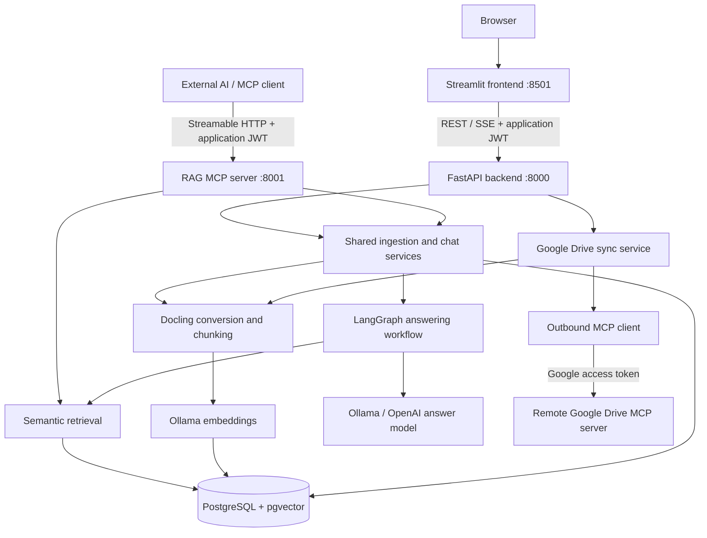
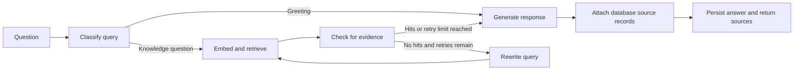

# Agentic RAG Knowledge Assistant

**An AI-powered RAG knowledge base system for documents and Google Drive.**

Agentic RAG Knowledge Assistant turns uploaded files and documents synchronized from Google Drive into a searchable knowledge base. Users can manage documents, ask questions in persistent conversations, and inspect source excerpts returned with answers. External AI applications can access the same database-backed knowledge through a Model Context Protocol (MCP) server.

Retrieval-Augmented Generation (RAG) combines document retrieval with language-model generation: the system finds relevant document chunks and supplies them as evidence for an answer. A bounded LangGraph workflow handles query routing, retrieval retries, generation, and source attachment.

This is a development implementation. The following describes the code currently present, with known limitations and a proposed evaluation strategy identified separately.

## Technology stack

| Layer | Technologies | Purpose |
| --- | --- | --- |
| Runtime | Python 3.13+, uv | Application runtime and locked dependency installation |
| Frontend | Streamlit, HTTPX | Account forms, dashboard, document management, streaming chat |
| Backend | FastAPI, Uvicorn, Pydantic settings | Validated REST APIs, configuration, server-sent events (SSE) |
| Authentication | PyJWT, pwdlib with Argon2 | Expiring bearer tokens and password hashing |
| Agent workflow | LangGraph | Retrieval and answering stages with persistent checkpoints |
| Document processing | Docling, HybridChunker, tiktoken | Conversion, optional PDF OCR, structural chunking, token counting |
| Model access | OpenAI Python SDK | Ollama or OpenAI answer generation; Ollama embeddings |
| Storage | PostgreSQL 16, pgvector | Application records, text chunks, 1,024-dimensional vectors, HNSW cosine index |
| Database access | SQLAlchemy, asyncpg, Alembic | Async repositories and schema migrations |
| Checkpoints | LangGraph PostgreSQL checkpointer, Psycopg | Persistent graph state per user and conversation |
| Integrations | MCP Python SDK, HTTPX | Application MCP server and outbound Google Drive MCP client |
| Infrastructure | Docker Compose | PostgreSQL/pgvector with a persistent data volume |

## Application architecture



REST and MCP are separate server entrypoints sharing services, repositories, authentication settings, and PostgreSQL. Streamlit calls REST rather than opening database connections. Google Drive synchronization is an outbound integration initiated through the backend.

The main application tables are `users`, `conversation_threads`, `messages`, `documents`, `document_chunks`, `ingestion_jobs`, and `source_items`. Chunks store text, vectors, page/section information, and metadata. Source items associate a user's Drive file ID and modification version with an indexed document. LangGraph maintains additional checkpoint tables.

### Ingestion pipeline

1. Validate the extension, MIME type, size, and basic file signature.
2. Convert PDF, DOCX, or UTF-8 TXT into a Docling document. PDF processing supports OCR and table extraction.
3. Detect duplicate documents for the same owner using the Docling origin binary hash.
4. Create contextualized chunks with headings and page information. HybridChunker currently uses a 512-token tokenizer budget.
5. Normalize text, generate embeddings, and validate vector count, dimensions, and finite values.
6. Store document metadata, chunks, vectors, and ingestion-job status in PostgreSQL.

Uploads and Drive synchronization run within the request; there is no background worker queue. The default upload limit is 25 MB.

### RAG answering workflow



Retrieval ranks completed-document chunks by cosine similarity after owner and optional conversation filtering. Defaults are five results, a similarity threshold of `0.2`, and one retry when no evidence is found. Chat requests the current conversation's chunks plus the owner's global chunks; see the scope limitation below.

The generation prompt supplies retrieved evidence and up to eight previous messages. It instructs the model to treat document content as untrusted data, preserve factual details, and acknowledge insufficient evidence. Responses contain `answer`, `grounded`, and sources with document/chunk identifiers, page numbers when available, similarity scores, and excerpts. Streaming emits `token`, `complete`, and, on failure, `error` events.

The `grounded` flag reflects available evidence and response handling. It is not an independent factual-correctness score.

## Tasks by component

| Component | Available tasks |
| --- | --- |
| Frontend: accounts | Register, sign in, view account details, sign out |
| Frontend: dashboard | View document/chunk counts, stored-byte totals, conversation activity, ingestion status, and API/database/MCP health |
| Frontend: knowledge base | Upload PDF/DOCX/TXT, select global or conversation scope, list/delete documents, trigger Drive sync, view sync counts |
| Frontend: conversations | Create/select conversations, load history, ask questions, receive streamed answers, inspect source excerpts |
| Backend: identity | Validate credentials, hash passwords, issue JWTs, check active users on protected requests |
| Backend: documents | Validate, convert, deduplicate, chunk, embed, index, list, inspect metadata, delete documents and dependent chunks |
| Backend: conversations | Create/list/get/delete owned threads, persist messages/checkpoints, answer through JSON or SSE |
| Backend: integrations | Synchronize a configured Google Drive folder into the requesting user's knowledge base |
| MCP server | Expose metadata, semantic search, ingestion, and grounded answering to authenticated clients |
| MCP client | Initialize authenticated Streamable HTTP sessions with the application server or remote Drive server |

## API routes

All paths below are complete paths. Protected routes require `Authorization: Bearer <application-access-token>`, obtained from login.

| Method | Route | Auth | Purpose |
| --- | --- | --- | --- |
| GET | `/` | Public | Welcome response |
| GET | `/health/live` | Public | Process liveness |
| GET | `/health/ready` | Public | Database readiness |
| POST | `/api/v1/auth/register` | Public | Register with `username`, `email`, `password` |
| POST | `/api/v1/auth/login` | Public | Exchange `email` and `password` for a token |
| GET | `/api/v1/users/me` | Bearer | Current-user details |
| POST | `/api/v1/threads` | Bearer | Create a conversation with `title` |
| GET | `/api/v1/threads` | Bearer | List conversations |
| GET | `/api/v1/threads/{thread_id}` | Bearer | Get an owned conversation |
| DELETE | `/api/v1/threads/{thread_id}` | Bearer | Delete conversation, dependent resources, and checkpoints |
| POST | `/api/v1/documents/upload` | Bearer | Multipart `file` and optional `thread_id` |
| GET | `/api/v1/documents` | Bearer | List owned document metadata |
| GET | `/api/v1/documents/{document_id}` | Bearer | Get document metadata |
| DELETE | `/api/v1/documents/{document_id}` | Bearer | Delete document and chunks |
| POST | `/api/v1/data-sources/google-drive/sync` | Bearer | Sync configured Drive folder; no request body |
| POST | `/api/v1/chat/{thread_id}` | Bearer | Answer a JSON `question` with sources |
| POST | `/api/v1/chat/{thread_id}/stream` | Bearer | Answer a JSON `question` through SSE |
| GET | `/api/v1/chat/{thread_id}/history` | Bearer | Chronological message history |
| GET | `/api/v1/metrics/overview` | Bearer | Owner-specific inventory and activity metrics |

API reference: [Swagger UI](http://localhost:8000/api/v1/docs), [ReDoc](http://localhost:8000/api/v1/redoc), and [OpenAPI JSON](http://localhost:8000/api/v1/openapi.json).

Semantic search is exposed through MCP and internal repositories; no standalone REST retrieval router is mounted. The separate MCP process provides a database health check at `http://localhost:8001/health`.

## Google Drive synchronization through MCP

Select **Sync Google Drive** in the knowledge-base interface or call `POST /api/v1/data-sources/google-drive/sync`.

1. The backend opens a session with the configured remote Google Drive MCP endpoint using a Google access token.
2. The connector calls `search_files` with a parent-folder query and follows pagination. Optional recursive discovery visits subfolders and enforces a file-count limit.
3. The service compares modification times against `source_items`. Successfully indexed, unchanged files are skipped.
4. It fetches supported files using `download_file_content`. Native Google Docs are requested as plain-text exports; PDF, DOCX, and TXT use the existing ingestion pipeline.
5. Documents are indexed globally for the requesting owner, with Drive IDs, source URLs, modification times, and original MIME types in metadata.
6. Successful replacements update source mappings. An old Drive-origin document is removed only when no source item references it. Individual file failures are recorded while remaining files continue.

The response includes `folder_id`, `discovered`, `indexed`, `unchanged`, `duplicates`, `skipped`, and `failed`. `duplicates` is a subset of `indexed`, not an additional mutually exclusive outcome.

| Setting | Purpose / default |
| --- | --- |
| `GOOGLE_DRIVE_MCP_URL` | Remote endpoint; defaults to `https://drivemcp.googleapis.com/mcp/v1` |
| `GOOGLE_DRIVE_FOLDER_ID` | Required root folder ID |
| `GOOGLE_DRIVE_ACCESS_TOKEN` | Required Google bearer token with access to the folder |
| `GOOGLE_DRIVE_QUOTA_PROJECT` | Optional project sent as `x-goog-user-project` |
| `GOOGLE_DRIVE_INCLUDE_SUBFOLDERS` | Recursive discovery; default `true` |
| `GOOGLE_DRIVE_MAX_FILES` | Discovery limit; default `100` |

Sync is a manual import that reads from Drive. There is no scheduled polling, webhook, write-back, reconciliation of files removed from Drive, or built-in Google OAuth consent/token-refresh flow. Sheets, Slides, and shortcuts are not supported ingestion formats. The folder and Google credentials are deployment-wide settings; imported records belong to the application user who triggers sync.

The connector's expected remote response schema, including pagination keys and base64 download output, still needs live integration verification.

## RAG server, clients, and database exposure

The **RAG server** provides shared ingestion, retrieval, and answering services through REST and MCP. The **Streamlit client** uses REST for the browser experience. The reusable **MCP client** in [backend/app/mcp/client.py](backend/app/mcp/client.py) connects AI applications to MCP tools and is also used by the Drive connector.

The application MCP server exposes controlled operations over PostgreSQL-backed knowledge. Each tool resolves the authenticated active user and applies ownership checks. It does not expose arbitrary SQL, database credentials, or unrestricted table access. Metadata tools return metadata; search returns chunk excerpts; ingestion explicitly writes indexed content.

| MCP tool | Inputs | Result |
| --- | --- | --- |
| `list_documents` | None | Owned document metadata |
| `get_document` | `document_id` | One owned document's metadata |
| `search_documents` | `query`, optional `top_k`, optional `thread_id` | Ranked excerpts, scores, and source identifiers |
| `ingest_document` | `filename`, `mime_type`, `content_base64`, optional `thread_id` | Document, duplicate flag, chunk count |
| `answer_from_documents` | `query`, `thread_id` | Persisted answer, grounding flag, sources |

Create a thread through REST before calling `answer_from_documents`. The application MCP server has no thread-creation or Drive-sync tool. Drive synchronization is initiated through REST/UI and calls remote Drive tools internally.

Example client usage after obtaining an application JWT:

```python
import asyncio
import os

from backend.app.mcp.client import authenticated_mcp_session


async def main():
    async with authenticated_mcp_session(
        "http://localhost:8001/mcp",
        os.environ["RAG_ACCESS_TOKEN"],
    ) as session:
        result = await session.call_tool(
            "search_documents",
            arguments={"query": "What is the onboarding process?", "top_k": 5},
        )
        print(result.structured_content)


asyncio.run(main())
```

Use an application login token for the local server and a Google token for the remote Drive server. This setup uses Streamable HTTP. Configuration also offers stdio, but an equivalent authenticated stdio flow has not been established here.

## Local setup

Prerequisites: Python 3.13+, uv, Docker Compose, and Ollama with an installed chat model and an embedding model returning 1,024-dimensional vectors.

Install dependencies from the repository root:

```bash
uv sync --locked
```

Create or update `.env`. Replace model placeholders with installed model names and supply your own secrets:

```dotenv
POSTGRES_HOST=localhost
POSTGRES_PORT=5432
POSTGRES_USER=rag_user
POSTGRES_PASSWORD=replace-with-your-local-database-password
POSTGRES_DB=agentic_rag
JWT_SECRET=replace-with-a-long-random-secret

LLM_PROVIDER=ollama
LLM_MODEL=your-installed-chat-model
LLM_BASE_URL=http://localhost:11434/v1
EMBEDDING_PROVIDER=ollama
EMBEDDING_MODEL=your-installed-1024-dimensional-embedding-model
EMBEDDING_DIMENSION=1024
EMBEDDING_BASE_URL=http://localhost:11434/v1

MCP_TRANSPORT=streamable-http
MCP_PORT=8001
```

Add the Drive settings above when using sync. `DATABASE_URL`, if set, overrides individual PostgreSQL settings. Python services run on the host in this example, so `POSTGRES_HOST=localhost` overrides the default container hostname `postgres`.

Start PostgreSQL and apply migrations:

```bash
docker compose up -d postgres
uv run alembic upgrade head
```

Run each application process in a separate terminal from the repository root:

```bash
# REST API
uv run uvicorn backend.app.main:app --reload --host 127.0.0.1 --port 8000
```

```bash
# Application MCP server
uv run python -m backend.app.mcp.server
```

```bash
# Frontend
uv run streamlit run frontend/app.py
```

Open `http://localhost:8501`, register, upload or sync documents, create a conversation, and ask a question. The frontend defaults to `BACKEND_URL=http://localhost:8000` and `MCP_HEALTH_URL=http://localhost:8001/health`; export these variables when using different addresses.

For OpenAI answer generation, set `LLM_PROVIDER=openai`, `LLM_MODEL`, and `LLM_API_KEY`; embeddings still use Ollama. Docker Compose starts only PostgreSQL. The root `main.py` is a placeholder and does not start the application.

## Evaluation strategy

The repository contains manual MCP exploration scripts, but no automated RAG benchmark, labeled evaluation dataset, or published quality results. The following is a proposed plan, not measured performance.

### Dataset and procedure

Build a versioned dataset from a fixed document snapshot, with questions, reference answers, expected document/chunk evidence, owner IDs, and conversation scope. Include factual questions, tables, scanned PDFs, multi-document synthesis, follow-ups, conflicting sources, unanswerable questions, and document-embedded prompt-injection attempts.

Use a development set for tuning and a separate held-out set for reporting. Record model names, embedding dimension, chunking implementation, retrieval settings, corpus version, and code revision. Evaluate retrieval separately from generation, then run end-to-end questions through REST and MCP. Repeat generation runs to measure variability and have human reviewers check a sample of model-graded results.

| Area | Measures | Test cases |
| --- | --- | --- |
| Parsing/indexing | Extraction accuracy, indexing success, metadata accuracy | PDF/DOCX/TXT, OCR, tables, corrupt/oversized files, duplicates, invalid vectors |
| Retrieval | Recall@k, Precision@k, MRR | Expected evidence presence/rank; comparisons of top-k and threshold settings |
| Answer quality | Reference correctness, supported-claim proportion, completeness | Names, dates, quantities, exceptions, conflicts, multi-document synthesis |
| Sources | Citation relevance, evidence coverage, identifier validity | Excerpts support claims and map to authorized stored chunks |
| Abstention | Correct abstention and false-refusal rates | Empty knowledge base, irrelevant documents, evidence below threshold |
| Access boundaries | Unauthorized disclosure count, expected rejection rate | Missing/expired tokens, inactive users, foreign IDs, cross-conversation retrieval |
| Drive sync | Accurate counts, unchanged-run idempotency, update correctness | Pagination, nested folders, changed/duplicate/unsupported/deleted files, expired token, partial failures |
| REST/MCP consistency | Equivalent evidence and persisted behavior | Scope, ingestion results, history, errors |
| Performance | p50/p95 retrieval/answer latency, time to first token, ingestion throughput | Corpus growth, concurrent users, provider failure, long sync requests |

Recall@k measures the fraction of labeled relevant evidence retrieved in the first k results; Precision@k measures how much of those results is relevant. MRR measures the reciprocal rank of the first relevant result. Similarity scores and `grounded` do not substitute for answer-quality evaluation.

### Acceptance and regression checks

Establish a baseline before setting numerical quality and latency targets. Treat any cross-user disclosure as a release blocker. Require valid source identifiers and stable document/chunk counts after an unchanged Drive rerun. After source updates, verify retrieval returns replacement content; track unsupported deletion reconciliation explicitly.

Use deterministic model/connector doubles for service tests and real PostgreSQL/pgvector for retrieval and migration integration tests. Run live Drive contract tests separately against a controlled folder. Include browser checks for sign-in, upload, sync feedback, streamed completion/errors, and source display. Repeat the held-out benchmark when changing models, chunking, prompts, retrieval, or synchronization.

## Current implementation limitations

- Ingestion does not copy a document's `thread_id` onto its new chunks. Those chunks currently have global scope for their owner, so conversation isolation needs correction and regression coverage. MCP search with a `thread_id` excludes global chunks, whereas chat includes them.
- Chunking fixes the tokenizer budget at 512 tokens; `CHUNK_SIZE` and `CHUNK_OVERLAP` are not applied by this path. `RETRIEVAL_MAX_CONTEXT_CHARS` is not enforced by the answering workflow.
- Source validation attaches retrieved records; it does not independently verify that each generated claim follows from those records.
- Drive sync has the manual-import and remote-contract limitations described above.
- `MCP_PATH` is validated in settings but is not passed to the server app factory. Use the default `/mcp` endpoint for this setup.

## Repository guide

```text
backend/app/
  api/              REST routes
  auth/             Password hashing and JWT authentication
  agents/           LangGraph workflow, providers, checkpoints
  connectors/       Remote Google Drive MCP adapter
  core/             Settings, dependencies, errors, logging
  db/               Database sessions and model base
  ingestion/        Validation, conversion, normalization, embeddings
  mcp/              Application MCP server, client, auth, tools
  models/           SQLAlchemy persistence models
  repositories/     Owner-scoped queries and metrics
  retrieval/        pgvector similarity search
  schemas/          Request/response models
  services/         Ingestion, chat, Drive synchronization
backend/migrations/ Alembic migrations
frontend/           Streamlit app and REST client
architecture/       Authentication and LangGraph design notes
scripts/            Ingestion and manual MCP exploration utilities
docker-compose.yml  Local PostgreSQL/pgvector service
pyproject.toml      Project metadata and dependencies
uv.lock             Locked dependency versions
```
